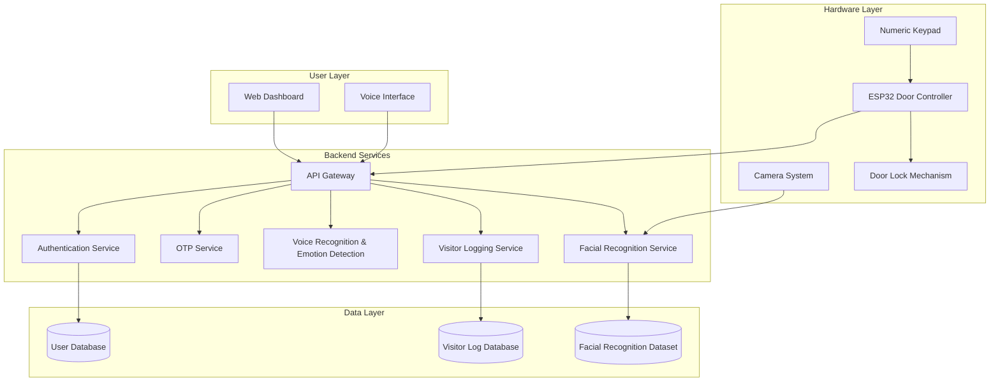

# Design Document: Smart Home Automation System

## Overview

The Smart Home Automation System is a distributed application that combines web-based user interfaces, backend services, and IoT hardware to provide secure, intelligent access control. The system architecture follows a microservices pattern with clear separation between the web frontend, authentication services, AI/ML services, hardware controllers, and data persistence layers.

The system enables users to manage home access through multiple authentication methods: facial recognition for automatic entry, OTP-based temporary access, and voice-controlled interactions with emotion-aware responses. All access attempts are logged with visitor identification and timestamps for security auditing.

## Architecture

### High-Level Architecture



### Technology Stack

**Frontend:**
- React or Vue.js for web dashboard
- i18next for multi-language support (English, Hindi, Tamil, Telugu)
- Web Speech API for voice interaction
- Responsive design for mobile and desktop

**Backend:**
- RESTful API architecture
- JWT for session management
- WebSocket for real-time hardware communication
- TLS 1.3 for all communications

**AI/ML Services:**
- Face recognition: OpenCV with deep learning models (FaceNet or similar)
- Voice recognition: Speech-to-text API (Google Speech API or similar)
- Emotion detection: Audio analysis with pre-trained emotion classification models
- Minimum 95% confidence threshold for facial recognition

**Hardware:**
- ESP32 microcontroller with WiFi capability
- USB camera (1080p minimum resolution)
- 4x4 matrix keypad for numeric input
- Electronic door lock (12V solenoid or electromagnetic)

**Database:**
- PostgreSQL for user data and visitor logs
- File storage for facial recognition dataset images
- Redis for OTP caching and session management

## Components and Interfaces

### 1. Web Dashboard Component

**Responsibilities:**
- Render user interface in selected language
- Display user profile and nickname
- Provide voice chatbot interface
- Show visitor logs and system status

**Interfaces:**
```typescript
interface DashboardProps {
  user: User;
  language: Language;
  onLanguageChange: (lang: Language) => void;
}

interface User {
  id: string;
  email: string;
  nickname: string;
  profilePicture: string;
  preferredLanguage: Language;
}

type Language = 'en' | 'hi' | 'ta' | 'te';
```

### 2. Authentication Service

**Responsibilities:**
- User registration with validation
- User login with credential verification
- Session token generation and validation
- Password hashing and security

**Interfaces:**
```typescript
interface AuthService {
  register(email: string, password: string, nickname: string, language: Language): Promise<User>;
  login(email: string, password: string): Promise<SessionToken>;
  validateSession(token: string): Promise<User>;
  logout(token: string): Promise<void>;
}

interface SessionToken {
  token: string;
  expiresAt: Date;
  userId: string;
}
```

### 3. OTP Service

**Responsibilities:**
- Generate 6-digit OTP codes
- Store OTPs with 5-minute expiration
- Verify OTP codes
- Clean up expired OTPs

**Interfaces:**
```typescript
interface OTPService {
  generateOTP(userId: string): Promise<OTP>;
  verifyOTP(code: string): Promise<boolean>;
  invalidateOTP(code: string): Promise<void>;
}

interface OTP {
  code: string;
  userId: string;
  createdAt: Date;
  expiresAt: Date;
  isUsed: boolean;
}
```

### 4. Voice Recognition and Emotion Detection Service

**Responsibilities:**
- Convert speech to text
- Identify speaker voice
- Detect emotional state from audio
- Process voice commands

**Interfaces:**
```typescript
interface VoiceService {
  recognizeSpeech(audioData: AudioBuffer, language: Language): Promise<VoiceResult>;
  detectEmotion(audioData: AudioBuffer): Promise<EmotionState>;
  processCommand(text: string, userId: string): Promise<CommandResponse>;
}

interface VoiceResult {
  text: string;
  userId: string;
  confidence: number;
}

type EmotionState = 'happy' | 'sad' | 'neutral' | 'angry' | 'surprised';

interface CommandResponse {
  action: string;
  response: string;
  success: boolean;
}
```

### 5. Facial Recognition Service

**Responsibilities:**
- Process camera images
- Compare faces against authorized dataset
- Return match results with confidence scores
- Manage facial recognition dataset

**Interfaces:**
```typescript
interface FacialRecognitionService {
  recognizeFace(imageData: ImageBuffer): Promise<FaceMatch>;
  addPersonToDataset(personId: string, name: string, images: ImageBuffer[]): Promise<void>;
  removePersonFromDataset(personId: string): Promise<void>;
  updateDataset(): Promise<void>;
}

interface FaceMatch {
  matched: boolean;
  personId: string | null;
  confidence: number;
  personName: string | null;
}
```

### 6. Visitor Logging Service

**Responsibilities:**
- Create visitor log entries
- Store visitor images
- Query visitor history
- Generate access reports

**Interfaces:**
```typescript
interface VisitorLoggingService {
  logVisitor(entry: VisitorEntry): Promise<VisitorLog>;
  getVisitorHistory(startDate: Date, endDate: Date): Promise<VisitorLog[]>;
  getVisitorById(personId: string): Promise<VisitorLog[]>;
}

interface VisitorEntry {
  personId: string;
  personName: string | null;
  isValid: boolean;
  accessMethod: 'facial_recognition' | 'otp';
  imageData: ImageBuffer;
}

interface VisitorLog {
  id: string;
  personId: string;
  personName: string | null;
  timestamp: Date;
  isValid: boolean;
  accessMethod: string;
  imageUrl: string;
}
```

### 7. ESP32 Door Controller

**Responsibilities:**
- Maintain connection to backend
- Receive unlock/lock commands
- Control door lock mechanism
- Capture keypad input
- Send status updates

**Interfaces:**
```cpp
class DoorController {
public:
  void connect(const char* serverUrl, const char* apiKey);
  void handleKeypadInput();
  void unlockDoor(int durationSeconds);
  void lockDoor();
  void sendStatus();
  bool isConnected();
private:
  void reconnect();
  void processCommand(String command);
};
```

### 8. API Gateway

**Responsibilities:**
- Route requests to appropriate services
- Authenticate API requests
- Rate limiting
- Request/response logging

**Endpoints:**
```
POST   /api/auth/register
POST   /api/auth/login
POST   /api/auth/logout
GET    /api/user/profile
PUT    /api/user/profile
POST   /api/otp/generate
POST   /api/otp/verify
POST   /api/voice/recognize
POST   /api/voice/command
POST   /api/face/recognize
POST   /api/face/dataset/add
DELETE /api/face/dataset/:personId
GET    /api/visitors/logs
GET    /api/visitors/:personId
POST   /api/door/unlock
POST   /api/door/lock
```

## Data Models

### User Model

```typescript
interface User {
  id: string;              // UUID
  email: string;           // Unique, validated email
  passwordHash: string;    // bcrypt hash with cost factor 12
  nickname: string;        // Display name
  profilePicture: string;  // URL to profile image
  preferredLanguage: Language;
  createdAt: Date;
  lastLoginAt: Date;
  isActive: boolean;
}
```

**Database Schema (PostgreSQL):**
```sql
CREATE TABLE users (
  id UUID PRIMARY KEY DEFAULT gen_random_uuid(),
  email VARCHAR(255) UNIQUE NOT NULL,
  password_hash VARCHAR(255) NOT NULL,
  nickname VARCHAR(100) NOT NULL,
  profile_picture TEXT,
  preferred_language VARCHAR(2) NOT NULL,
  created_at TIMESTAMP DEFAULT CURRENT_TIMESTAMP,
  last_login_at TIMESTAMP,
  is_active BOOLEAN DEFAULT true
);

CREATE INDEX idx_users_email ON users(email);
```

### OTP Model

```typescript
interface OTP {
  code: string;           // 6-digit numeric code
  userId: string;         // User who generated the OTP
  createdAt: Date;
  expiresAt: Date;        // createdAt + 5 minutes
  isUsed: boolean;
}
```

**Storage (Redis):**
```
Key: otp:{code}
Value: {userId, createdAt, expiresAt, isUsed}
TTL: 300 seconds (5 minutes)
```

### Visitor Log Model

```typescript
interface VisitorLog {
  id: string;                    // UUID
  personId: string;              // Unique identifier for the person
  personName: string | null;     // Name if recognized, null otherwise
  timestamp: Date;               // When the visit occurred
  isValid: boolean;              // Whether person was authorized
  accessMethod: AccessMethod;    // How they attempted access
  imageUrl: string;              // URL to captured image
  accessGranted: boolean;        // Whether door was unlocked
}

type AccessMethod = 'facial_recognition' | 'otp';
```

**Database Schema (PostgreSQL):**
```sql
CREATE TABLE visitor_logs (
  id UUID PRIMARY KEY DEFAULT gen_random_uuid(),
  person_id VARCHAR(255) NOT NULL,
  person_name VARCHAR(255),
  timestamp TIMESTAMP DEFAULT CURRENT_TIMESTAMP,
  is_valid BOOLEAN NOT NULL,
  access_method VARCHAR(50) NOT NULL,
  image_url TEXT NOT NULL,
  access_granted BOOLEAN NOT NULL
);

CREATE INDEX idx_visitor_logs_timestamp ON visitor_logs(timestamp);
CREATE INDEX idx_visitor_logs_person_id ON visitor_logs(person_id);
```

### Facial Recognition Dataset Model

```typescript
interface FacialDatasetEntry {
  personId: string;        // Unique identifier
  name: string;            // Person's name
  imageUrls: string[];     // Multiple images for better recognition
  createdAt: Date;
  updatedAt: Date;
}
```

**Database Schema (PostgreSQL):**
```sql
CREATE TABLE facial_dataset (
  person_id VARCHAR(255) PRIMARY KEY,
  name VARCHAR(255) NOT NULL,
  created_at TIMESTAMP DEFAULT CURRENT_TIMESTAMP,
  updated_at TIMESTAMP DEFAULT CURRENT_TIMESTAMP
);

CREATE TABLE facial_images (
  id UUID PRIMARY KEY DEFAULT gen_random_uuid(),
  person_id VARCHAR(255) REFERENCES facial_dataset(person_id) ON DELETE CASCADE,
  image_url TEXT NOT NULL,
  created_at TIMESTAMP DEFAULT CURRENT_TIMESTAMP
);

CREATE INDEX idx_facial_images_person_id ON facial_images(person_id);
```

### Session Model

```typescript
interface Session {
  token: string;          // JWT token
  userId: string;
  createdAt: Date;
  expiresAt: Date;        // createdAt + 24 hours
}
```

**Storage (Redis):**
```
Key: session:{token}
Value: {userId, createdAt, expiresAt}
TTL: 86400 seconds (24 hours)
```

## Correctness Properties

*A property is a characteristic or behavior that should hold true across all valid executions of a system—essentially, a formal statement about what the system should do. Properties serve as the bridge between human-readable specifications and machine-verifiable correctness guarantees.*


### Property 1: Successful Registration Creates Complete User Account

*For any* valid registration data (email, password, nickname, language), successful registration should create a user account with all fields correctly populated and the preferred language stored.

**Validates: Requirements 1.1, 1.3**

### Property 2: Duplicate Email Registration Rejection

*For any* email address, attempting to register a second user with the same email should always fail and return an error.

**Validates: Requirements 1.2**production devices)
- Rollback capability for firmware updates
- Version tracking and update logs
 space < 20%
- Memory usage > 85%

### Deployment Strategy

**Backend:**
- Containerized deployment using Docker
- Orchestration with Kubernetes or Docker Compose
- Blue-green deployment for zero-downtime updates
- Automated rollback on health check failures

**Frontend:**
- Static site hosting (Netlify, Vercel, or S3 + CloudFront)
- Automatic deployment on main branch merge
- Preview deployments for pull requests

**Hardware:**
- Over-the-air (OTA) firmware updates for ESP32
- Staged rollout (test device → facial recognition and voice recognition into independent services

### Monitoring and Alerting

**Metrics to Monitor:**
- API response times (p50, p95, p99)
- Authentication success/failure rates
- Door unlock/lock events per hour
- Facial recognition accuracy rates
- Hardware connection status
- Database query performance
- Error rates by endpoint

**Alerts:**
- Door controller disconnected > 5 minutes
- Authentication failure rate > 20%
- API response time p95 > 2 seconds
- Database connection failures
- Disk pooling for database (min: 5, max: 20 connections)
5. **Lazy Loading:** Lazy load visitor log images in dashboard

### Scalability Considerations

1. **Horizontal Scaling:** Design backend services to be stateless for horizontal scaling
2. **Load Balancing:** Use load balancer for API gateway (round-robin or least connections)
3. **Database Sharding:** Partition visitor logs by date for better query performance
4. **CDN Integration:** Serve static assets and images through CDN
5. **Microservices:** Separate  Limiting:** Implement rate limiting on all API endpoints (100 requests/minute per IP)
5. **CORS Configuration:** Restrict CORS to specific frontend domains only

### Performance Optimization

1. **Database Indexing:** Create indexes on frequently queried fields (email, timestamp, person_id)
2. **Caching Strategy:** Cache user sessions, OTPs, and facial recognition results in Redis
3. **Image Optimization:** Compress captured images before storage (JPEG quality 85%)
4. **Connection Pooling:** Use connection API responses
- Mock WebSocket connections

**Hardware Testing:**
- ESP32 simulator for unit tests
- Physical hardware for integration tests
- Mock backend server for offline testing

## Implementation Notes

### Security Considerations

1. **API Key Management:** Store ESP32 API keys in secure environment variables, rotate every 90 days
2. **Image Storage:** Encrypt facial images at rest using AES-256
3. **Audit Logging:** Log all authentication attempts, door access events, and administrative actions
4. **Rate
5. Build and package
6. Deploy to staging
7. End-to-end tests on staging
8. Manual approval for production

**Test Execution Time:**
- Unit tests: < 2 minutes
- Property tests: < 5 minutes
- Integration tests: < 3 minutes
- Total CI pipeline: < 15 minutes

### Test Environment

**Backend Testing:**
- PostgreSQL test database (Docker container)
- Redis test instance (Docker container)
- Mock facial recognition service
- Mock voice recognition service

**Frontend Testing:**
- Jest + React Testing Library
- Mockript
const confidenceScoreGenerator = () => fc.float({ min: 0, max: 1 });
const personIdGenerator = () => fc.uuid();
const faceMatchGenerator = () => fc.record({
  matched: fc.boolean(),
  personId: fc.option(personIdGenerator(), { nil: null }),
  confidence: confidenceScoreGenerator(),
  personName: fc.option(fc.string(), { nil: null })
});
```

### Continuous Integration

**CI Pipeline:**
1. Lint and format check
2. Unit tests (parallel execution)
3. Property-based tests (parallel execution)
4. Integration tests () => fc.string({ minLength: 1, maxLength: 100 });
const languageGenerator = () => fc.constantFrom('en', 'hi', 'ta', 'te');

const validRegistrationDataGenerator = () => fc.record({
  email: validEmailGenerator(),
  password: validPasswordGenerator(),
  nickname: nicknameGenerator(),
  language: languageGenerator()
});
```

**OTP Generator:**
```typescript
const otpCodeGenerator = () => fc.integer({ min: 100000, max: 999999 })
  .map(n => n.toString());
```

**Facial Recognition Data Generator:**
```typescnctions
- Integration tests: hardware communication protocols
- Property tests: OTP verification, command handling
- Hardware-in-the-loop tests: actual door lock control

### Test Data Generators

Property-based tests require generators for random test data:

**User Data Generator:**
```typescript
const validEmailGenerator = () => fc.emailAddress();
const validPasswordGenerator = () => fc.string({ minLength: 8 })
  .filter(pwd => /[A-Z]/.test(pwd) && /[a-z]/.test(pwd) && /[0-9]/.test(pwd));
const nicknameGenerator =```

### Test Coverage Requirements

**Backend Services:**
- Unit test coverage: minimum 80%
- Property test coverage: all 37 correctness properties
- Integration tests: all API endpoints
- End-to-end tests: critical user flows (registration → login → door access)

**Frontend:**
- Unit test coverage: minimum 70%
- Component tests: all UI components
- Integration tests: user interactions and state management
- Accessibility tests: WCAG 2.1 AA compliance

**Hardware (ESP32):**
- Unit tests: all command processing fuript
// Feature: smart-home-automation, Property 1: Successful Registration Creates Complete User Account
test('registration with valid data creates complete user account', () => {
  fc.assert(fc.property(
    validRegistrationDataGenerator(),
    async (regData) => {
      const user = await authService.register(regData);
      expect(user.email).toBe(regData.email);
      expect(user.nickname).toBe(regData.nickname);
      expect(user.preferredLanguage).toBe(regData.language);
    }
  ), { numRuns: 100 });
});
Configuration

**Testing Library:** 
- For TypeScript/JavaScript: fast-check
- For Python: Hypothesis
- For embedded C++ (ESP32): RapidCheck or custom generators

**Test Configuration:**
- Minimum 100 iterations per property test (due to randomization)
- Seed-based reproducibility for failed tests
- Shrinking enabled to find minimal failing cases
- Timeout: 30 seconds per property test

**Test Tagging:**
Each property-based test must include a comment tag referencing the design document property:

```typescmponents
- Hardware communication protocols

**Property-Based Tests** focus on:
- Universal properties that hold for all inputs
- Comprehensive input coverage through randomization
- Invariants that must be maintained
- Round-trip properties (serialization, encryption, etc.)
- State machine properties

Both testing approaches are complementary and necessary. Unit tests catch concrete bugs in specific scenarios, while property tests verify general correctness across a wide range of inputs.

### Property-Based Testing 

**Voice Command Ambiguous:**
- Return message: "Did you mean [option A] or [option B]?"
- Provide clarification options
- Wait for user confirmation

## Testing Strategy

### Dual Testing Approach

The system will employ both unit testing and property-based testing to ensure comprehensive coverage:

**Unit Tests** focus on:
- Specific examples demonstrating correct behavior
- Edge cases (empty inputs, boundary values, special characters)
- Error conditions and exception handling
- Integration points between coimeouts exceed threshold

**Data Integrity Violation:**
- Return HTTP 400 with specific error message
- Log violation details
- Do not modify database state
- Return user to previous state

### Voice Recognition Errors

**Speech Not Recognized:**
- Return message: "Sorry, I didn't understand that. Please try again."
- Provide audio feedback
- Log unrecognized input for training

**Emotion Detection Failure:**
- Default to "neutral" emotion state
- Continue processing command
- Log failure for model improvementt signals
- Alert administrators immediately
- Fall back to facial recognition only
- Log hardware failure event

### Database Errors

**Connection Failure:**
- Retry connection up to 3 times
- Use connection pooling with automatic recovery
- Return HTTP 503 with error message: "Service temporarily unavailable"
- Alert administrators immediately

**Query Timeout:**
- Set timeout to 5 seconds for all queries
- Return HTTP 504 with error message: "Request timeout"
- Log slow query for optimization
- Alert if trs

### Hardware Communication Errors

**Door Controller Disconnected:**
- Log disconnection event with timestamp
- Attempt reconnection every 10 seconds
- Alert administrators if disconnected > 5 minutes
- Door controller continues with cached OTPs

**Command Transmission Failure:**
- Retry command up to 3 times with exponential backoff
- Log failure after 3 attempts
- Alert administrators
- Return error to user: "Unable to control door, please try again"

**Keypad Malfunction:**
- Detect via missing heartbeaFacial Recognition Errors

**Low Confidence Match:**
- Classify as Invalid_Person
- Log attempt with confidence score
- Do not unlock door
- Capture image for review

**Camera Failure:**
- Return error message: "Camera unavailable"
- Alert administrators immediately
- Fall back to OTP-only mode
- Log hardware failure event

**Recognition Service Unavailable:**
- Return error message: "Facial recognition temporarily unavailable"
- Fall back to OTP-only mode
- Attempt service reconnection
- Alert administratots"
- Include lockout expiration time in response

### OTP Errors

**Invalid OTP:**
- Return error message: "Invalid OTP code"
- Log failed attempt with timestamp
- Do not unlock door

**Expired OTP:**
- Return error message: "OTP has expired, please request a new code"
- Remove OTP from cache
- Do not unlock door

**OTP Generation Failure:**
- Return HTTP 500 with error message: "Unable to generate OTP, please try again"
- Log error with stack trace
- Alert administrators if failures exceed threshold

### 
## Error Handling

### Authentication Errors

**Invalid Credentials:**
- Return HTTP 401 with error message: "Invalid email or password"
- Log failed attempt with timestamp and IP address
- Increment failed attempt counter for rate limiting

**Expired Session:**
- Return HTTP 401 with error message: "Session expired, please login again"
- Clear session from Redis cache
- Redirect to login page

**Account Locked:**
- Return HTTP 403 with error message: "Account temporarily locked due to multiple failed attemputhentication attempts within 15 minutes should trigger a 30-minute account lockout.

**Validates: Requirements 14.5**

### Property 36: Offline OTP Verification

*For any* valid OTP cached locally on the door controller, it should be verifiable even when the backend is unavailable.

**Validates: Requirements 15.2**

### Property 37: Offline Log Queuing

*For any* visitor log created while the backend is unavailable, it should be queued and transmitted when connection is restored.

**Validates: Requirements 15.3**
mage.

**Validates: Requirements 13.3**

### Property 33: Password Hashing Security

*For any* stored user password, it should be hashed using bcrypt with a cost factor of at least 12.

**Validates: Requirements 14.3**

### Property 34: Input Sanitization

*For any* user input containing potentially malicious content (SQL injection, XSS), the system should sanitize or reject the input.

**Validates: Requirements 14.4**

### Property 35: Account Lockout After Failed Attempts

*For any* user account, 5 failed aeen the door controller and backend, reconnection attempts should occur every 10 seconds.

**Validates: Requirements 12.2**

### Property 31: Door Controller Command Processing

*For any* lock or unlock command sent from the backend, the door controller should activate or deactivate the lock mechanism accordingly.

**Validates: Requirements 12.3, 12.4**

### Property 32: Image and Log Association

*For any* captured visitor image, it should be stored with a corresponding visitor log entry that references the ints 11.1, 11.2**

### Property 28: Facial Dataset Removal

*For any* person in the facial dataset, removing them should result in their images no longer being part of the recognition system.

**Validates: Requirements 11.3, 11.4**

### Property 29: Multiple Images Per Person

*For any* person in the facial dataset, the system should support storing and using multiple facial images for that person.

**Validates: Requirements 11.5**

### Property 30: Door Controller Reconnection

*For any* connection loss betwid/Invalid), and access method (facial_recognition or OTP).

**Validates: Requirements 10.2, 10.3, 10.4, 10.5**

### Property 26: Visitor Log Persistence

*For any* visitor log entry created, it should be retrievable from the database at any later time.

**Validates: Requirements 10.6**

### Property 27: Facial Dataset Addition

*For any* facial image addition with valid Person_ID and name, the image should be successfully added to the dataset and become part of the recognition system.

**Validates: Requirements 9.2**

### Property 23: Door Auto-Lock Timing

*For any* door unlock event, the door should remain unlocked for exactly 10 seconds and then automatically re-lock.

**Validates: Requirements 9.3, 9.4**

### Property 24: Visitor Detection Logging

*For any* person detected at the door, a visitor log entry should be created.

**Validates: Requirements 10.1**

### Property 25: Visitor Log Completeness

*For any* visitor log entry, it should contain a unique Person_ID, timestamp, validity classification (Valuld classify as Valid_Person if confidence ≥ 95%, and Invalid_Person if confidence < 95% or no match found.

**Validates: Requirements 8.3, 8.4**

### Property 21: Valid Authentication Unlocks Door

*For any* valid authentication (either Valid_Person via facial recognition or valid OTP), the door controller should unlock the door.

**Validates: Requirements 9.1, 9.5**

### Property 22: Invalid Person Door Remains Locked

*For any* Invalid_Person detection, the door should remain locked.

**Validates: Requireme

**Validates: Requirements 6.4, 6.5**

### Property 18: Keypad Input Capture

*For any* sequence of keypad button presses, the door controller should correctly capture the numeric input.

**Validates: Requirements 7.1**

### Property 19: Keypad Timeout Clearing

*For any* partial keypad entry, if no additional input is received for 30 seconds, the entry should be cleared.

**Validates: Requirements 7.3**

### Property 20: Facial Recognition Confidence Threshold

*For any* facial image comparison, the system shoneration request, the system should produce a unique 6-digit numeric code.

**Validates: Requirements 6.1**

### Property 16: OTP Expiration Timing

*For any* generated OTP, it should be valid for verification within 5 minutes of creation and invalid after 5 minutes.

**Validates: Requirements 6.2, 6.3**

### Property 17: OTP Verification Round-Trip

*For any* generated OTP, verifying it with the correct code should succeed before expiration, and verifying with an incorrect code or after expiration should fail. user with reasonable confidence.

**Validates: Requirements 5.1**

### Property 13: Emotion Detection

*For any* voice sample, the emotion detection system should return one of the defined emotion states (happy, sad, neutral, angry, surprised).

**Validates: Requirements 5.2**

### Property 14: Voice Command Execution

*For any* valid voice command, the system should execute the corresponding action and provide audio feedback.

**Validates: Requirements 5.5**

### Property 15: OTP Generation Format

*For any* OTP ge10: Profile Display Completeness

*For any* user accessing the dashboard, both their profile icon and nickname should be displayed.

**Validates: Requirements 4.1, 4.2**

### Property 11: Profile Update Persistence

*For any* user, updating their nickname or profile picture should succeed and the new values should persist across sessions.

**Validates: Requirements 4.4**

### Property 12: Voice Identity Recognition

*For any* registered user's voice sample, the voice recognition system should correctly identify thee 24 hours from creation and invalid after 24 hours from creation.

**Validates: Requirements 2.4, 2.5**

### Property 8: Language-Based UI Rendering

*For any* user with a preferred language setting, the dashboard should render all interface elements in that language.

**Validates: Requirements 3.1**

### Property 9: Language Change Reactivity

*For any* user, changing their language preference should immediately update all interface text to the new language.

**Validates: Requirements 3.3**

### Property r any* registered user, providing their correct email and password should result in successful authentication and creation of a valid session token.

**Validates: Requirements 2.1, 2.3**

### Property 6: Invalid Credentials Rejection

*For any* authentication attempt with incorrect credentials (wrong password or non-existent email), the system should reject the attempt and return an error.

**Validates: Requirements 2.2**

### Property 7: Session Expiration

*For any* session token, it should be valid befor

### Property 3: Password Validation Rules

*For any* password string, the system should accept it if and only if it contains at least 8 characters, at least one uppercase letter, at least one lowercase letter, and at least one number.

**Validates: Requirements 1.4**

### Property 4: Registration Notification

*For any* successful user registration, a confirmation notification should be queued or sent to the user's email.

**Validates: Requirements 1.5**

### Property 5: Valid Credentials Authentication

*Fo